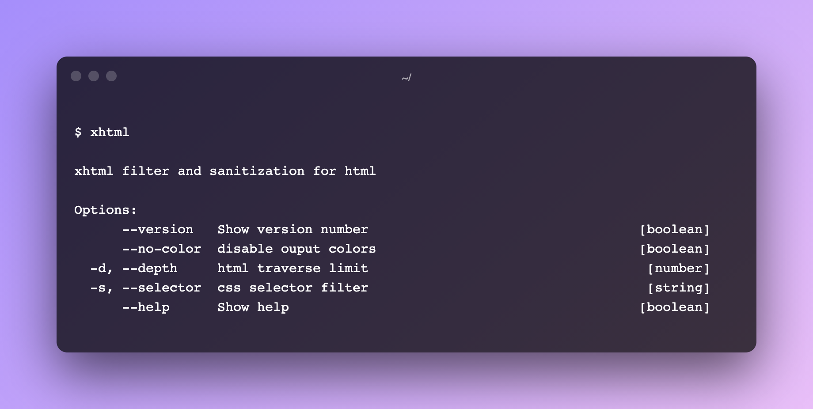
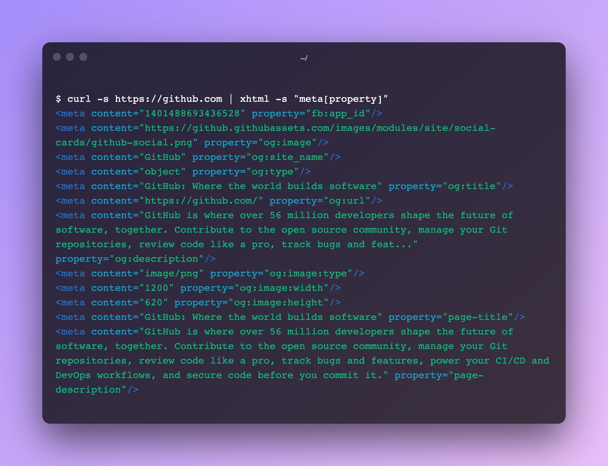
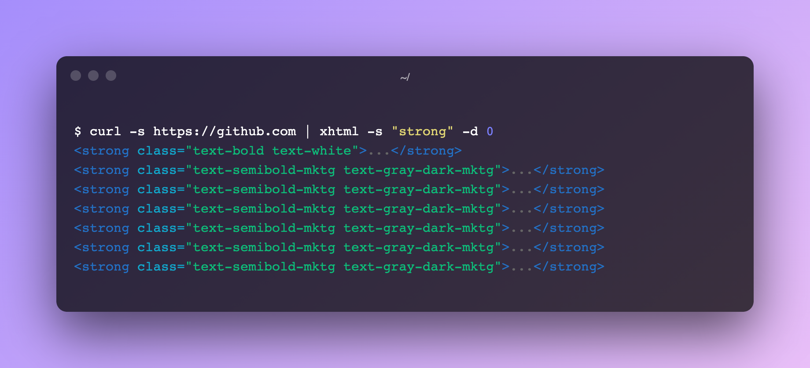
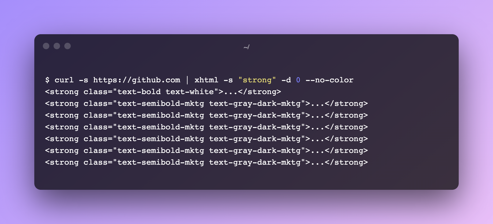

# XHTML

HTML filter and sanitization cli tool

## Install

```bash
  npm install -g xhtml-cli
```

## Usage

```bash
  xhtml --help
```



## Filtering tags

```bash
  curl -s https://github.com | xhtml -s "meta[property]"
  curl -s https://github.com | xhtml -selector "meta[property]"
```



## Limiting depth output

```bash
  curl -s https://github.com | xhtml -s "strong" -d 0
  curl -s https://github.com | xhtml -selector "strong" -depth 0
```



## No color output

```bash
  curl -s https://github.com | xhtml -s "strong" -d 0 --no-color
  curl -s https://github.com | xhtml -selector "strong" -depth 0 --no-color
```


